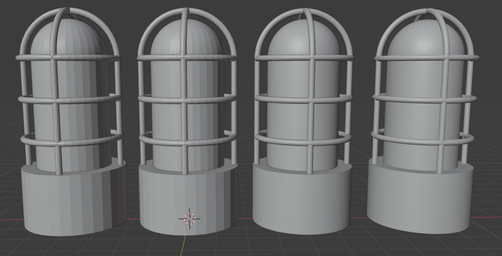
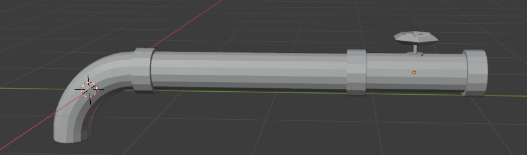
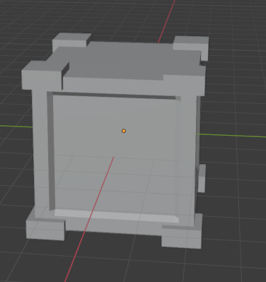

# Miscellaneous Props

This directory is for all the random props that we make

# Warning Light

First: Flat model, all the primitives are separate.
Second: Flat model, the cage pieces are joined, the inside light is joined.
Third: Smooth version of the second model.
Fourth: All the pieces are joined together into one shape.

# Pipes

These are modular pipe pieces that can be put together to create decorations. Pipes are stored in the `pipes` subdirectory.

# Crate

A stackable crate to decorate the room with. We'll stack a bunch of them along the left corner of the room to fill up that space.
